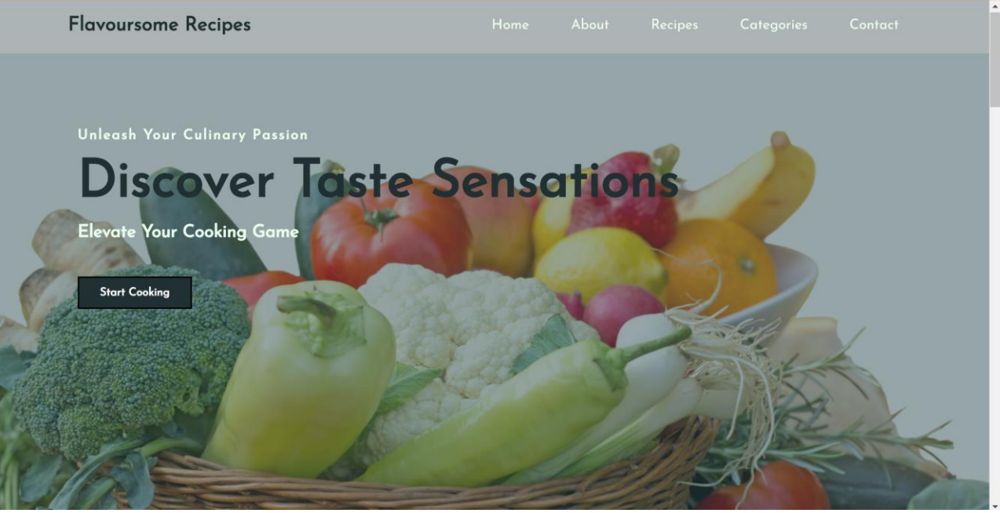
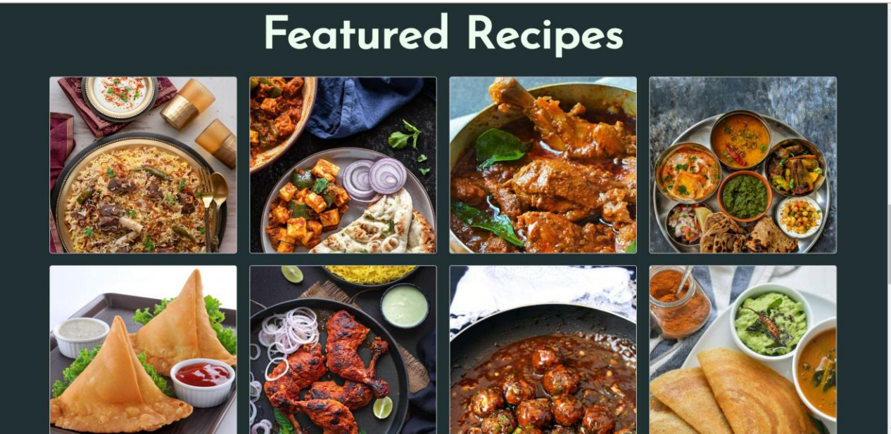
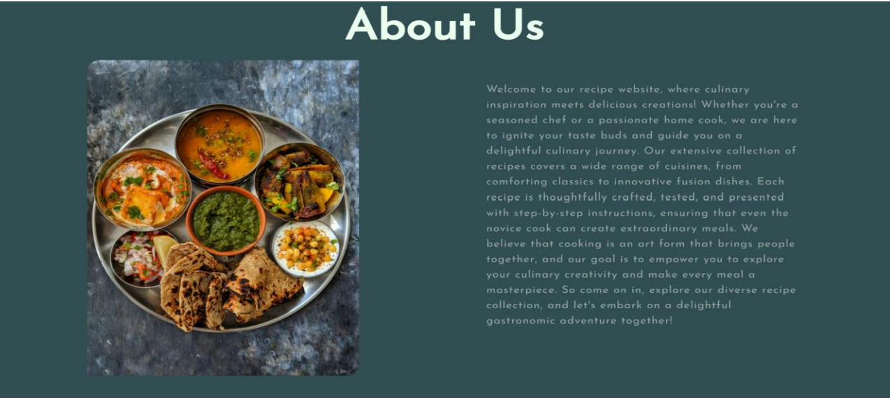
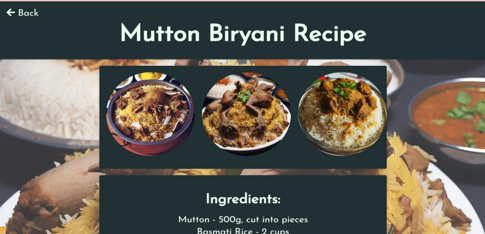

# Culinery Website

This project showcases a variety of Indian thali dishes using a web interface. It includes HTML files for individual sections (such as main courses and desserts), a CSS file for styling, and a JavaScript file for functionality.

# Project Structure

The project consists of the following files:

- `index.html`: The main homepage of the project.
- `mc.html`: The page displaying main course information.
- `r1.html`, `r2.html`, `r3.html`: Pages for different recipes. - These pages have internal css
- `dessert.html`: The page displaying dessert information.
- `da.css`: The CSS file for styling.
- `script2.js`: The JavaScript file for functionality.
- Image files used to enhance the visual representation of dishes.

# Getting Started

To run the project locally, follow these steps:

# 1. Clone the Repository

Clone the project from GitHub to your local machine.

```bash
git clone https://github.com/yourusername/indian-thali-project.git
cd indian-thali-project
```

# 2. Project Structure Overview

- `index.html`: This is the main homepage.
- `mc.html`: Displays the main course section.
- `dessert.html`: Showcases desserts.
- `da.css`: Handles styling for the main page.
- `script2.js`: Adds interactivity or custom functionality.
- Images (e.g., `bc1.jpg`, `gulab_jamun.jpg`, etc.) are stored in the root directory for easy access.

# 3. HTML Files

- `index.html`: Contains links to other sections (main course, desserts, etc.) and is styled using `da.css`.
- `mc.html`: Lists main course dishes with descriptions and images.
- `dessert.html`: Lists dessert items with images.
- Recipe pages (`r1.html`, `r2.html`, etc.): Provide details for individual recipes, each with unique content and styling.

# 4. CSS File (`da.css`)

This file controls the layout, colors, fonts, and overall appearance of the web pages. Key sections include:

- Header and footer styling.
- Navigation bar layout.
- Image and text alignment.
- Mobile responsiveness for different screen sizes.

# 5. JavaScript File (`script2.js`)

This file adds functionality such as:

- Dynamic content loading (e.g., fetching and displaying new items).
- Page interactivity (e.g., image sliders, animations).

# 6. Running the Project

Open `index.html` in any modern web browser to view the homepage. From there, you can navigate to other sections (main course, desserts, etc.) using the menu.


# 7. Modifying the Project

You can edit the HTML, CSS, or JavaScript files to customize the content, style, or functionality.

- **HTML**: Add or modify content in `index.html`, `mc.html`, `dessert.html`, etc.
- **CSS**: Update styles in `da.css` to change the appearance.
- **JavaScript**: Modify `script2.js` to change the functionality.

# Screenshots

Here are some screenshots of the project:

- 
- 
- 
- 
